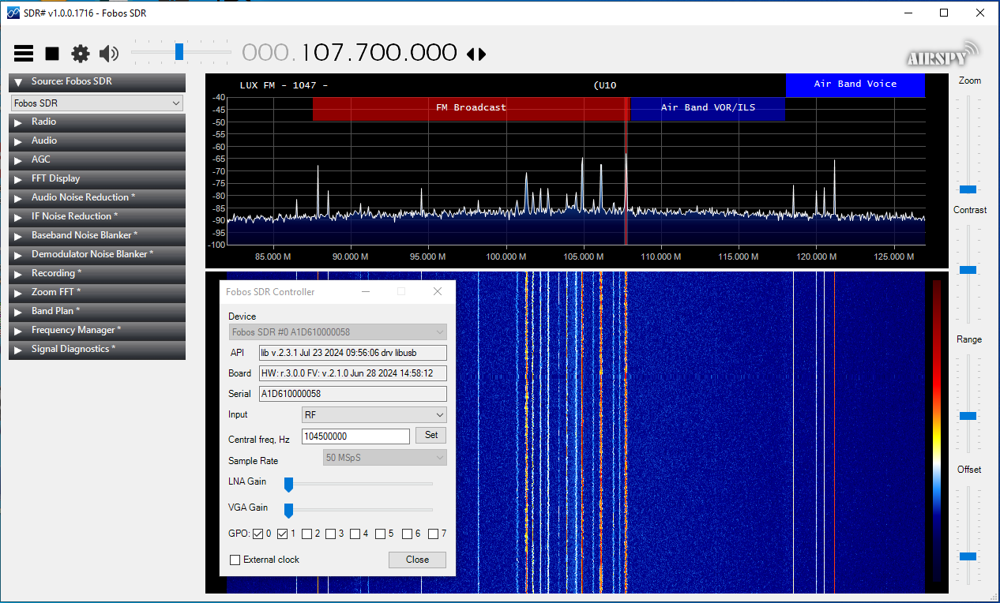
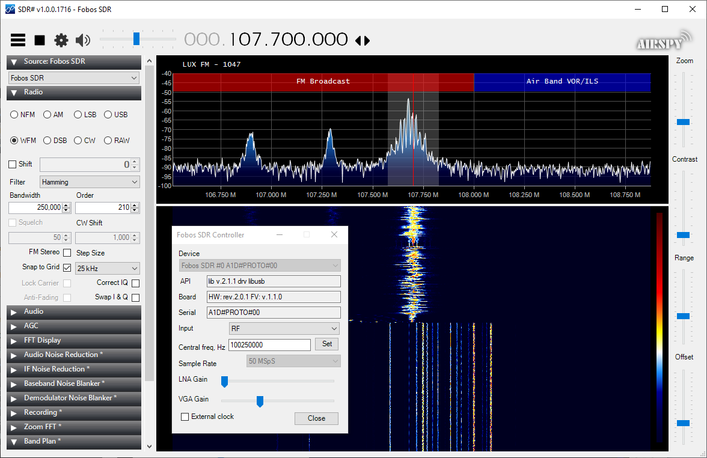
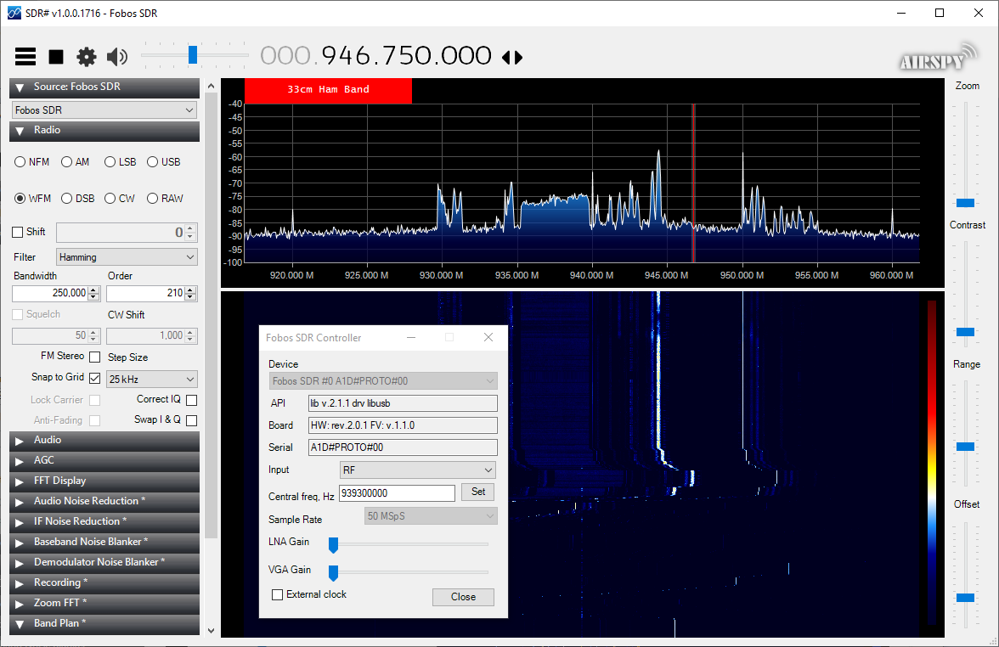

# SDRSharp-FobosSDR-plugin
SDR# frontend plugin for FobosSDR device API. 
Full source code. SDR# v.1716 compatible.

## Dependencies

- .Net v.4.6
- MS Visual Studio 2015
- SDR# v.1716 SDK

## How to build

- clone
- make **Debug** and/or **Release** directories
- dowbload SDR# v.1716 SDK, unpack to **Debug** and/or **Release** 
- open FobosSDRPlugin.sln
- Build and run (all dependencies are portable)

## How to install

- copy fobos.dll and SDRSharp.FobosSDR.dll to ypur SDR# directory
- add magic line from **magic line.txt** to **FrontEnds.xml** file
- run SDRSharp.exe

## How it looks like

 
 
 

## What is actually Fobos SDR

For more info see the main product page

https://rigexpert.com/en/products/kits-en/fobos-sdr/
